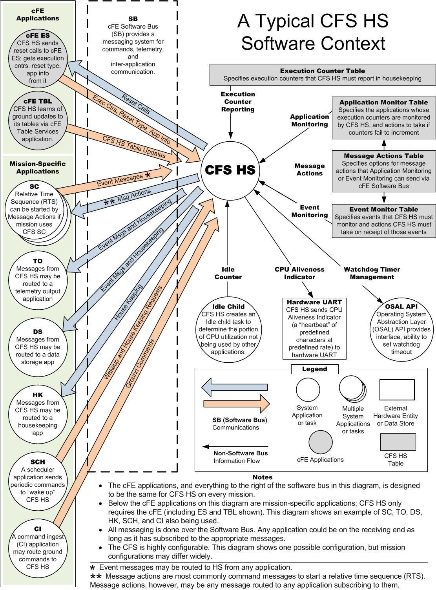

# cFS: Health and Safety

* [Original README](cfs-hs-app-OSS-readme.txt)

## Description

The Health and Safety application (HS) is a core Flight System (cFS) application
that is a plug in to the Core Flight Executive (cFE) component of the cFS.

The cFS is a platform and project independent reusable software framework and
set of reusable applications developed by NASA Goddard Space Flight Center. This
framework is used as the basis for the flight software for satellite data
systems and instruments, but can be used on other embedded systems. More
information on the cFS can be found at http://cfs.gsfc.nasa.gov

The HS application provides functionality for Application Monitoring, Event
Monitoring, Hardware Watchdog Servicing, Execution Counter Reporting (optional),
and CPU Aliveness Indication (via UART).

## Requirements

* [Operating System Abstraction Layer][osal] 4.1.1 or higher
* [core Flight Executive][cfe] 6.4.1 or higher

## Sources

* https://sourceforge.net/projects/cfs-hs/

[osal]: https://github.com/lassondesat/osal
[cfe]: https://github.com/lassondesat/coreflightexec
